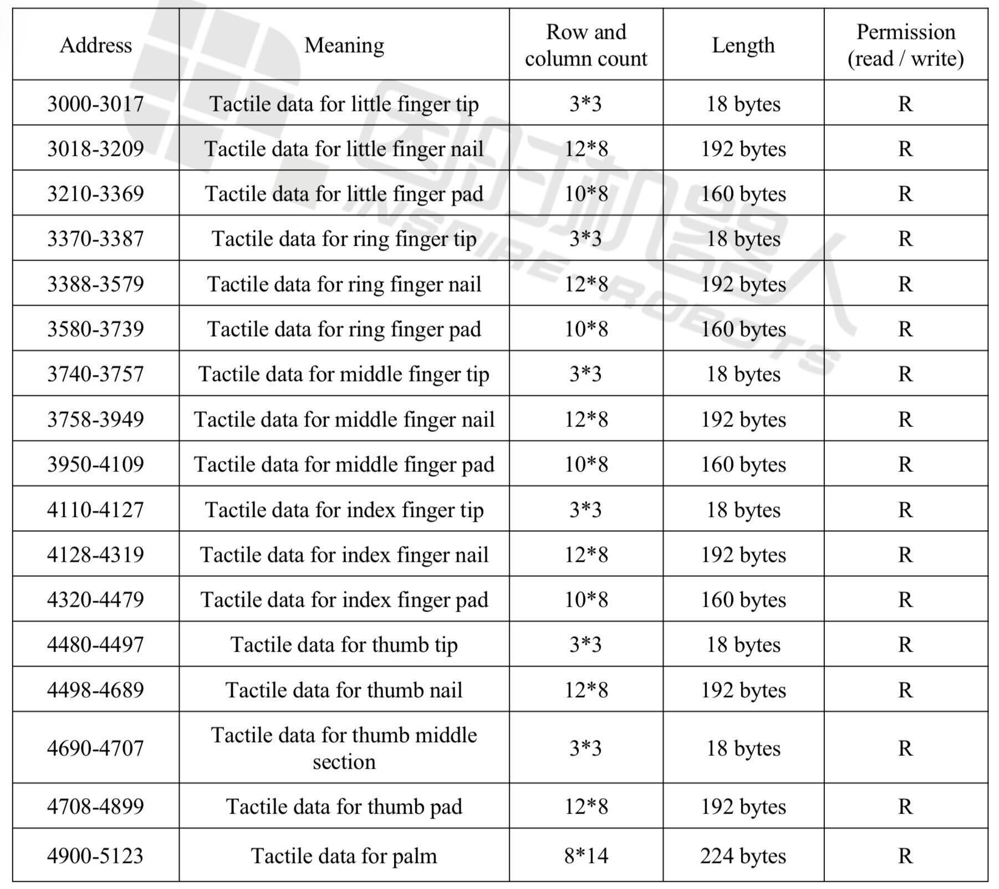
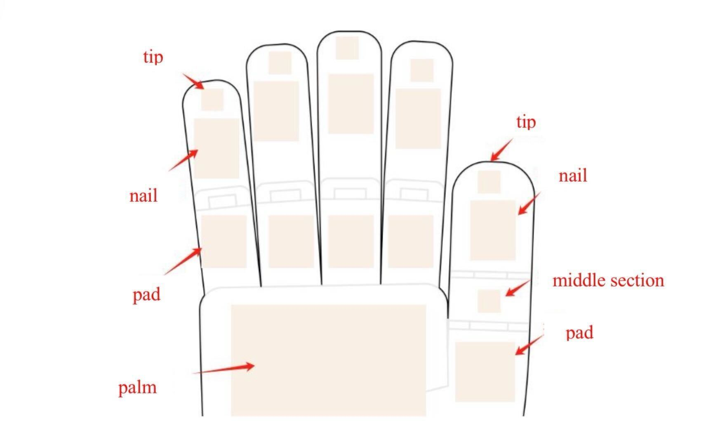
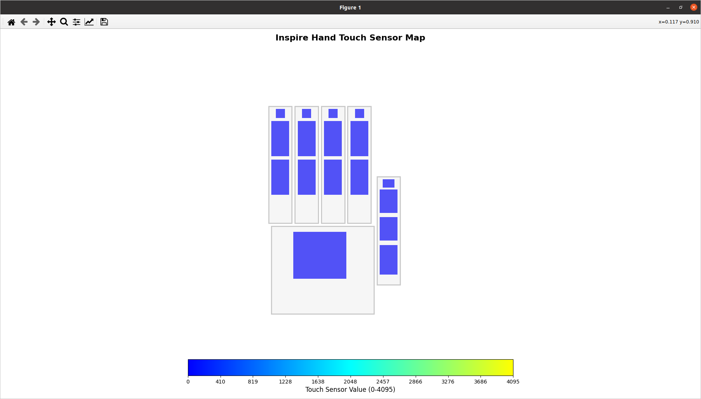

# Inspire Hand SDK Setup Guide (LIDAR Lab @ GT)

This guide describes the setup and usage of the Inspire Hand SDK for the LIDAR Lab at Georgia Tech.

---

## Inspire Hand Details






## Virtual Environment Management (Conda)

We use **conda** to manage the Python virtual environment.

### 1. Create and Activate Environment

```bash
conda create -n inspire_hand python=3.8
conda activate inspire_hand
```
---

## Installation

### 1. Clone Repository (if not already done)

```bash
git clone <repo_url>
cd InspireHand-Tactile-Sensing
```

### 2. Initialize and Update Submodules

```bash
git submodule init
git submodule update
```

### 3. Install SDKs (Editable Mode)

⚠️ We **do NOT** use `pip install -r requirements.txt`.

Instead, install the two SDKs in editable mode:

```bash
cd unitree_sdk2_python
pip install -e .

cd ../inspire_hand_sdk
pip install -e .
```

After installation, return to the root directory:

```bash
cd ..
```

---

## Configuring Wired Network Connection for Inspire Hands (One-time setup in Ubuntu)

To communicate with the Inspire Hands via Ethernet/USB-C:

1. **Open Wired Network Settings**  
   - Click the network icon in the top-right corner of Ubuntu  
   - Select **Wired Settings**  

2. **Create a New Profile**  
   - Click the **gear icon** next to your wired interface  
   - Select **IPv4** settings  
   - Set **Method** to `Manual`  
   - Assign a static IP in the same subnet as the Inspire Hands, e.g.:  
     - Example for PC: `192.168.123.100`  
     - Subnet Mask: `255.255.255.0`  
     - Gateway: leave blank  

3. **Connect to the Hands**  
   - The default IPs are:  
     - Left hand: `192.168.123.210`  
     - Right hand: `192.168.123.211`  
   - Save and apply the settings  
   - Open a terminal and test connectivity:  
     ```bash
     ping 192.168.123.210
     ping 192.168.123.211
     ```  
   - If replies are received, communication is normal  

> **Note:** Ensure your PC is directly connected to the hand via Ethernet or USB-C. Both the driver device and the hands must be on the same subnet to communicate properly.

## Running the Inspire Hands (LIDAR Lab Workflow)

All runtime scripts are located in:

```
/home/lidar/InspireHand-Tactile-Sensing/inspire_hand_sdk/example
```

### ⚠️ Important: Multi-Terminal Setup Required

You must run the driver in **one terminal**, and all visualization or other scripts in **separate terminals**.

---

### Step 1: Start the Headless Driver (Required)

In **Terminal 1**, activate conda and run:

```bash
conda activate inspire_hand
python inspire_hand_sdk/example/Headless_driver_double.py
```

This script:
- Initializes the hands
- Starts DDS communication
- Publishes and subscribes to required topics

***This must remain running before launching any other scripts.***

---

### Step 2: Run Visualization or Other Scripts

In **Terminal 2 (or more terminals)**:

```bash
conda activate inspire_hand
python inspire_hand_sdk/example/plot_force_hand_map_updated.py
```

This script:
- Subscribes to tactile sensor data
- Displays a GUI
- Plots force values on the tactile sensor map



A new set of scripts has been added for tactile data collection and robot hand pose toggling. These scripts are located in:
```bash
/home/lidar/InspireHand-Tactile-Sensing/data_collection_scripts
```

***These scripts are designed to run while the Headless_driver_double.py is active (multi-terminal setup still applies).***

## Control Modes

The Inspire Hand SDK supports multiple control modes:

- **Mode 0**: `0000` (No operation)  
- **Mode 1**: `0001` (Angle)  
- **Mode 2**: `0010` (Position)  
- **Mode 3**: `0011` (Angle + Position)  
- **Mode 4**: `0100` (Force control)  
- **Mode 5**: `0101` (Angle + Force control)  
- **Mode 6**: `0110` (Position + Force control)  
- **Mode 7**: `0111` (Angle + Position + Force control)  
- **Mode 8**: `1000` (Velocity)  
- **Mode 9**: `1001` (Angle + Velocity)  
- **Mode 10**: `1010` (Position + Velocity)  
- **Mode 11**: `1011` (Angle + Position + Velocity)  
- **Mode 12**: `1100` (Force control + Velocity)  
- **Mode 13**: `1101` (Angle + Force control + Velocity)  
- **Mode 14**: `1110` (Position + Force control + Velocity)  
- **Mode 15**: `1111` (Angle + Position + Force control + Velocity)  

---

## Summary (LIDAR Lab Standard Workflow)

1. Activate conda environment  
2. Start `Headless_driver_double.py` (Terminal 1)  
3. Run GUI or control scripts in separate terminals  
